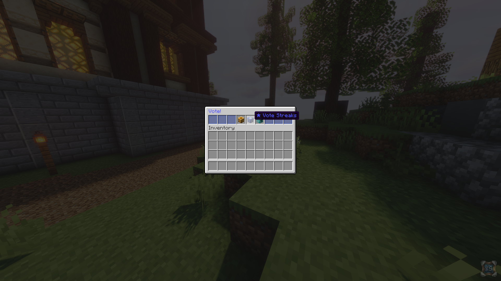
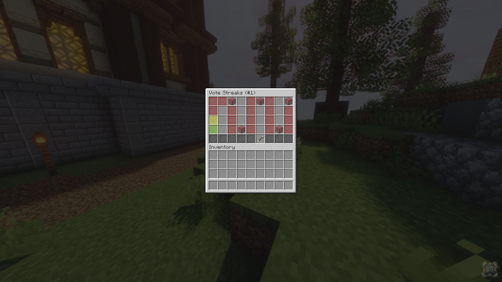
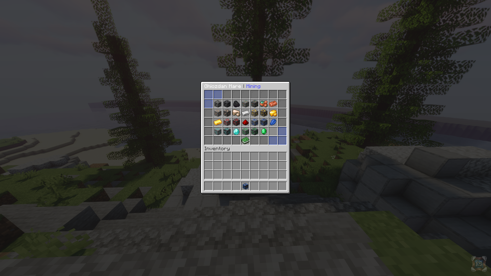

# Sezonul 2

## Vote Streaks

Un sistem de recompense bazat pe voturi, care devin mai bune pe masura ce avansati in streak. Tot ce aveti de facut este sa votati in **fiecare** zi si sa va conectati pentru a revendica rasplata \(in mod automat\).

## Tokens

O moneda univesala, **persistenta** intre sezoane si valabila pe toate sectiunile \(🔜\), folosita pentru a achizitiona diverse iteme speciale. In momentul de fata, aceasta se poate obtine prin **/vote** si ca reward la anumite [streak-uri](https://wiki.royalsaga.net/survival.changelog/s2#vote-streaks).

## Textura



## Rune

### Modificari

* Runele Mastery pot fi scoase cu un black scroll.

### Rune Scoase \(3\) 

* Commander
* Lifebloom
* Pick Pocket

### **Rune Adaugate \(28\)** 

#### **Common** 

* Carrot Planter
* Death Punch
* Potato Planter
* Wheat Planter

#### **Rare** 

* Bone Crusher
* Hasten
* Hunter
* Hook
* Immolate
* Slayer

#### Epic 

* Bowmaster
* Lucky
* Nightwalker
* Perish
* Soulless
* Suspend
* Veinminer

#### Legendary 

* Ambit
* Bait
* Beast Slayer
* End Master
* Nether Master
* Night Owl
* Poseidon
* Safeguard
* Smash
* Triumph

#### Mastery 

* Scare

### Rune Modificate \(4\)

* Obliterate
  * Redenumit in **Forcefield**
* Haste
  * Raritate: ~~Common~~ ⬆ **Mastery**
  * Necesita: **Hasten III**
* Telepathy
  * Raritate: ~~Rare~~ ⬆ **Legendary**
* Anti Gravity
  * Raritate: ~~Epic~~ ⬆ **Mastery**
  * Necesita: **Springs III**

## Ghiozdane

Capacitatea tuturor ghiozdanelor a fost crescuta astfel:

* Mic: ~~100~~ ➡ **250**
* Mediu: ~~250~~ ➡ **500**
* Mare: ~~500~~ ➡ **1.000**

Minereurile de tip [**Deepslate**](https://minecraft.fandom.com/wiki/Deepslate)**, Raw** [**Copper**](https://minecraft.fandom.com/wiki/Raw_Copper)**,** [**Gold**](https://minecraft.fandom.com/wiki/Raw_Gold)**,** [**Iron**](https://minecraft.fandom.com/wiki/Raw_Iron) au fost adaugate in ghiozdanul **Mining**.

De asemenea, ordinea actiunilor a fost inversata pentru a se potrivi cu cea din **/shop**.

