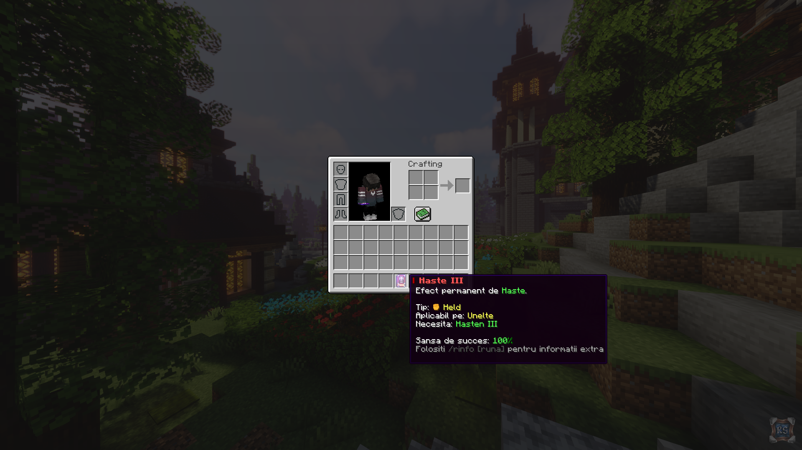

# Textura

O **mica **textura menita sa va **imbunatateasca** experienta pe serverul RoyalSaga!

Nu va faceti griji pentru performante, au fost facute teste pe un laptop cu **Intel® Pentium® 4** din 2011 si totul functiona la fel de bine. Datorita dimensiunii sale reduse (aprox. **150kb**), textura este descarcata in doar cateva secunde si aplicata la fel de repede (aprox. **10s**).

Pentru orice nelamurire, verificati sectiunea de [**Intrebari Frecvente**](https://wiki.royalsaga.net/survival/textura/intrebari-frecvente) sau intrati pe [**Discord**](https://royalsaga.net/discord).


[**Optifine**](https://optifine.net/downloads) este necesar pentru a vedea textura itemelor!


## Exemple

In continuare puteti observa cateva din elementele texturii si comparatii facute intre cum arata anumite lucruri **cu** si **fara** aceasta.


Pentru o calitate mai buna a imaginilor este sugerat sa folositi un PC / Laptop.


### Iconite pentru tipul runelor

### Enchanter



### Un chest plin cu rune

Sortarea runelor de la o ferma este un proces destul de indelungat atunci cand este vorba de un volum mare de iteme. Cu ajutorul texturii, sortarea unui **intreg chest** ar trebui sa dureze cateva **secunde**!



