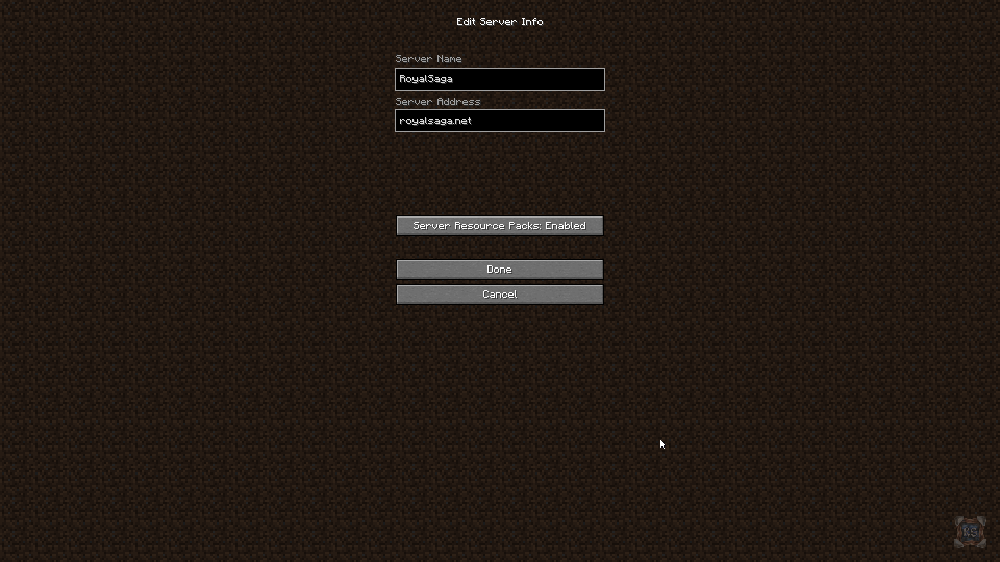

# Intrebari frecvente

## Am textura insa itemele arata la fel, de ce?

1. Asigurati-va ca aveti [Optifine](https://optifine.net/downloads) instalat.
2. Optiunea **Custom Items** este **ON **(`Options > Quality > Custom Items: ON`)

## De ce este textura descarcata de fiecare data cand intru pe server?

Acest lucru ne ofera o libertate mai mare cand vine vorba de updatat textura pentru ca tot ce trebuie vor sa faceti la final este sa reintrati pe server si aveti acces la ultima versiune a texturii.

Chiar daca asta inseamna sa asteptati aprox. 10s cand intrati pe Survival, va scapa de stresul de a verifica de fiecare data daca exista o versiune noua a texturii cand vreti sa jucati pe RoyalSaga.

## De ce vad simboluri 'chinezesti'?

Pentru a rezolva aceasta problema, trebuie sa aveti textura aplicata. In cazul in care ati refuzat-o prima data cand ati intrat pe server, din lista cu servere dati pe `Edit Server` si setati optiunea `Server Resource Packs` ca `Enabled` sau `Prompt`.

